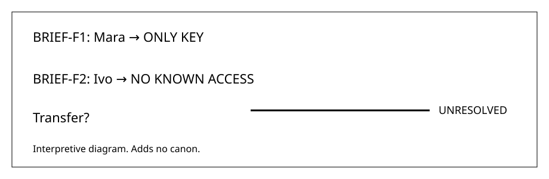

# Integrated FAITHFUL sample

## Source

[S01] Mara kept the lighthouse key.

[S02] Ivo waited outside the lantern room.

## Same document

[S01] Mara kept the lighthouse key.

Caption:
Interpretive key-state map.

Alt text:
Mara retains the key.
Ivo lacks known access.
No transfer is asserted.

Prose equivalent:
Mara keeps the key.
Ivo remains outside.
Any transfer stays unresolved.

[S02] Ivo waited outside the lantern room.

## Fidelity note

Both source sentences remain.

Their order remains unchanged.

No new event appears.

The visual adds interpretation.

It adds no canon.
